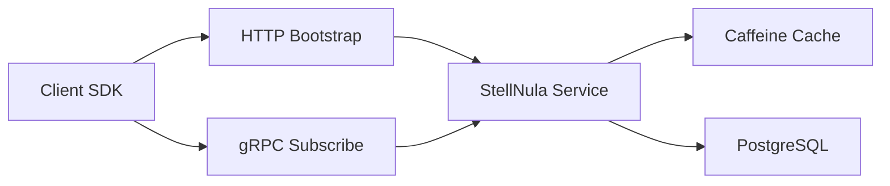

# StellNula Service

`stellnula-service` 是 StellHub 配置中心的服务端工程。StellNula 中文名“星云”，定位为面向客户端 SDK 的配置查询、全量同步、运行态订阅、配置缓存和故障降级服务。

## 项目概述

本项目不是简单 KV 服务，而是应用配置、公共配置、作用域隔离、版本发布、变更审计、客户端订阅和故障恢复共同组成的运行时控制面。

## 当前状态

| 项目 | 说明 |
| --- | --- |
| 稳定性 | 开发中 |
| 服务类型 | 配置中心服务端 |
| 推荐框架 | Spring Boot 3、StellFlux |
| 存储底座 | PostgreSQL |
| 缓存 | Caffeine |
| 维护方 | StellHub |

## 解决什么问题

- 管理应用配置和公共配置。
- 支持客户端首次全量配置拉取。
- 支持运行态配置订阅和变更感知。
- 支持服务端内存缓存，降低运行时 DB 依赖。
- 支持版本发布、审计和故障恢复。

## 不解决什么问题

- 不替代数据库本身。
- 不直接实现前端管理控制台。
- 不承载业务规则引擎。
- 不替代服务注册中心或消息队列。

## 核心能力

| 能力 | 说明 |
| --- | --- |
| 配置查询 | 按应用、环境和作用域查询配置 |
| 全量同步 | 客户端启动时拉取全量配置 |
| 运行态订阅 | 感知配置变更 |
| 本地缓存 | 服务端缓存热点配置 |
| 版本发布 | 管理配置版本 |
| 审计恢复 | 记录变更并支持恢复 |

## 架构说明



## 快速开始

```bash
mvn clean test
mvn clean package -DskipTests
mvn spring-boot:run
```

## 配置说明

| 配置项 | 是否必填 | 说明 |
| --- | --- | --- |
| server.port | 否 | HTTP 服务端口 |
| grpc.server.port | 是 | gRPC 订阅端口 |
| spring.datasource.url | 是 | PostgreSQL 地址 |
| stellnula.cache.enabled | 否 | 是否启用本地缓存 |
| stellnula.refresh.interval | 否 | 缓存刷新间隔 |

## 本地开发

```bash
mvn clean verify
```

涉及配置版本、缓存刷新、订阅推送和故障降级的改动必须补充测试。

## 版本与升级

- `MAJOR`：不兼容 API、配置模型或存储结构变更。
- `MINOR`：向后兼容的新能力。
- `PATCH`：向后兼容的问题修复。

## 可观测性

| 类型 | 名称 | 说明 |
| --- | --- | --- |
| Metric | stellnula_config_query_total | 配置查询次数 |
| Metric | stellnula_cache_hit_total | 缓存命中次数 |
| Metric | stellnula_subscribe_total | 订阅连接数量 |
| Log | CONFIG_REFRESH_FAILED | 配置刷新失败 |
| Log | SUBSCRIBE_DISCONNECTED | 订阅连接断开 |

## 故障排查

### 客户端拿不到配置

1. 检查应用、环境和命名空间是否匹配。
2. 检查服务端缓存是否加载成功。
3. 检查 PostgreSQL 是否可访问。
4. 检查客户端本地兜底配置是否生效。

## 安全说明

生产环境配置不应直接提交到仓库，配置变更应具备审计和回滚能力。

## 目录结构

```text
.
├── src/            # 服务源码
├── docs/           # 扩展文档
├── pom.xml         # Maven 构建文件
└── README.md       # 项目说明
```

## 贡献规范

- 配置模型和存储结构变更必须说明兼容性影响。
- 缓存、订阅和发布逻辑变更必须补充测试。
- 行为变更必须同步更新 README 或 docs。

## 支持

由 StellHub 维护。建议通过 GitHub Issues 记录问题、需求和设计讨论。

## 许可证

以仓库内 `LICENSE` 文件为准。