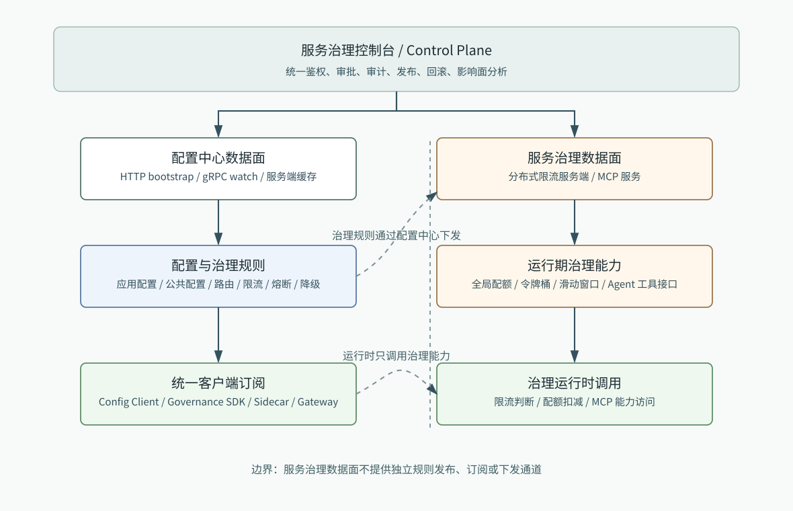

# Stellnula 架构设计

Stellnula 的目标不是只做一个配置读取服务，而是作为“配置 + 服务治理规则”的统一底座。配置中心数据面负责应用配置、公共配置和服务治理规则的统一下发；服务治理数据面不再建设独立规则下发通道，只保留分布式限流服务端、后续 MCP 服务等运行期能力。



## 1. Problem analysis

配置与服务治理规则具备相同的生命周期特征：

- 都需要统一鉴权、审批、审计、发布、回滚和影响面分析。
- 都需要按照环境、地域、可用区、集群、namespace 和 group 做作用域隔离。
- 都需要服务端缓存降低 DB 运行态依赖。
- 都需要通过配置中心数据面向客户端 SDK、Sidecar 或 Gateway 下发。
- 都需要版本、校验值和本地兜底能力，避免控制面故障直接影响业务运行。

因此，Stellnula 应该把配置定义、治理规则定义、作用域、版本发布和审计能力沉淀为公共底座。服务治理控制台只保留一个统一入口，对接配置中心数据面和服务治理数据面；治理规则下发统一走配置中心数据面。

## 2. Design

整体架构：

```text
服务治理控制台 / Control Plane
        |
        | 统一鉴权、审批、审计、发布、回滚、影响面分析
        |
        +--------------------------------------+
        |                                      |
配置中心数据面                         服务治理数据面
        |                                      |
应用配置 / 公共配置 / 治理规则          分布式限流服务端 / MCP 服务
        |
配置 SDK / Governance SDK / Sidecar / Gateway
```

### 2.1 控制面

控制面统一承载以下能力：

- 鉴权：校验用户、系统和自动化发布身份。
- 审批：高风险配置和治理规则需要审批后发布。
- 审计：记录配置定义、内容、作用域、版本和发布行为。
- 发布：生成 release 和 revision，并触发数据面缓存刷新。
- 回滚：以 release 为回滚点恢复旧版本。
- 影响面分析：基于 appId、namespace、env、region、zone、cluster 和订阅客户端计算影响范围。

### 2.2 配置中心数据面

配置中心数据面负责：

- 承载应用配置、公共配置和服务治理规则的统一读取。
- 管理 KV / FILE 两类配置形态。
- 维护敏感配置标记、脱敏展示和访问审计。
- 维护 release、revision、checksum 和客户端订阅状态。
- 通过 HTTP bootstrap 和 gRPC watch 向 Config Client、Governance SDK、Sidecar 和 Gateway 下发配置与治理规则。

### 2.3 服务治理数据面

服务治理数据面负责运行期治理能力，不负责规则下发：

- 分布式限流服务端，例如全局 QPS、配额扣减、令牌桶或滑动窗口聚合。
- 后续扩展 MCP 服务，面向 Agent 或平台工具暴露治理能力。
- 提供运行期状态、限流计数、配额消耗和健康信息查询。
- 消费配置中心数据面下发的治理规则快照，不能自建独立规则发布和订阅链路。

服务治理规则不应绕开配置中心单独建一套下发链路。路由、限流、熔断、降级规则都应作为配置中心中的治理规则配置发布，并由配置中心数据面统一下发。

## 3. Implementation

第一阶段推荐按如下边界推进：

- `control-console`：统一控制台，承载配置、治理规则、审批、发布、回滚和影响面分析。
- `config-data-plane`：HTTP bootstrap、全量配置拉取、gRPC watch，统一下发应用配置、公共配置和治理规则。
- `governance-data-plane`：分布式限流服务端、运行态治理状态服务和后续 MCP 服务。
- `common-release-core`：统一 release、revision、audit 和 impact analysis。
- `common-cache-core`：服务端全量缓存、作用域索引、revision 索引和刷新调度。

### 3.1 服务端缓存

配置中心数据面不应把客户端读取请求穿透到 PostgreSQL。运行态读取优先命中服务端内存缓存，缓存由启动加载和定时刷新维护。

缓存至少包含：

- 配置定义索引。
- 治理规则定义索引。
- 作用域索引。
- release / revision 索引。
- 客户端订阅索引。

### 3.2 发布传播

控制台写入 PostgreSQL 后生成 release 和 change event。配置中心数据面定时扫描最新 revision，并刷新受影响缓存分区。治理规则也走同一条发布传播路径，由配置中心数据面统一下发给 Governance SDK、Sidecar、Gateway 和服务治理数据面。

服务治理数据面只消费已发布规则，不产生规则发布事实。后续可以引入消息通知降低刷新延迟，但消息通知只能作为加速路径，不能替代 PostgreSQL 的最终持久化。

## 4. Complete code

本文档是架构约束文档。对应实现落地时应保证：

- 配置和治理规则共用发布、版本、审计、回滚语义。
- 配置读取和治理规则读取都通过配置中心数据面完成。
- 服务治理数据面不提供独立规则下发通道。
- 客户端、Governance SDK、Sidecar 和 Gateway 都具备本地缓存和故障降级能力。
- 服务治理数据面仅承担分布式限流服务端和后续 MCP 服务等运行期能力。
- 控制面不可用不影响已发布配置和已发布治理规则的运行态读取。
