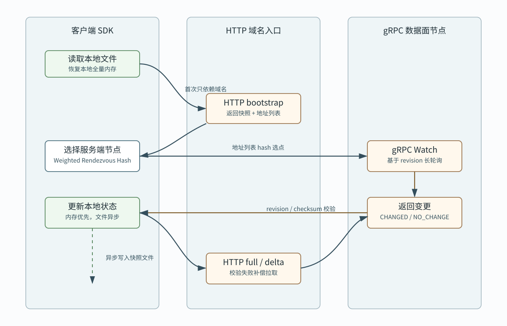

# HTTP 与 gRPC 混合协议选型

Stellnula 客户端与服务端采用 HTTP + gRPC 混合模型：首次交互使用 HTTP，后续长轮询使用 gRPC。HTTP 负责低门槛 bootstrap、全量拉取和兼容性；gRPC 负责运行态 watch、增量通知和双向状态上报。



## 1. Problem analysis

配置中心客户端有两个阶段：

- 启动阶段：客户端需要在只知道域名的情况下完成身份识别、上下文上报、全量配置拉取、服务端地址列表获取和本地快照初始化。
- 运行阶段：客户端需要长期订阅配置变更，并在配置变化时低延迟更新本地内存和本地文件。

单独使用 HTTP 可以降低接入成本，但长轮询连接数量大时协议表达和连接管理不够集中。单独使用 gRPC 可以优化运行态订阅，但首次接入需要客户端提前知道 gRPC 地址和服务发现细节，不利于故障恢复和跨语言兼容。

因此采用混合模型。

## 2. Design

### 2.1 HTTP 职责边界

HTTP 只负责以下任务：

- 首次 bootstrap。
- 获取服务端 HTTP / gRPC 地址列表。
- 获取服务端能力、协议版本和 watch 参数。
- 全量配置拉取。
- 增量配置补偿拉取。
- 客户端心跳兼容接口。
- 管理面 OpenAPI。

HTTP bootstrap 入口由域名访问，例如：

```text
https://config.example.com/api/v1/client/bootstrap
```

服务端返回地址列表，而不是要求客户端依赖注册中心：

```json
{
  "revision": 1024,
  "servers": [
    {
      "serverId": "stellnula-a",
      "httpAddress": "https://10.0.0.11:8443",
      "grpcAddress": "10.0.0.11:9090",
      "weight": 100,
      "zone": "sg-a",
      "healthy": true
    }
  ],
  "loadBalancing": {
    "strategy": "WEIGHTED_RENDEZVOUS_HASH",
    "hashKey": "appId:clientId:env:namespace",
    "failover": "NEXT_HEALTHY_CANDIDATE"
  }
}
```

### 2.2 gRPC 职责边界

gRPC 负责运行态长轮询：

- `Watch`：客户端携带当前 revision，服务端阻塞等待变更或超时。
- `FetchFull`：gRPC 内全量拉取，作为 HTTP full 的同协议版本。
- `FetchDelta`：根据 revision 增量拉取。
- `ReportClientState`：上报本地 revision、checksum 和文件缓存状态。

gRPC watch 不直接访问 PostgreSQL，只依赖服务端内存缓存和 revision 索引。

### 2.3 客户端负载均衡策略

默认策略选择 `Weighted Rendezvous Hash`。

选择原因：

- 长轮询连接需要稳定落点，避免频繁换节点。
- 客户端只有 bootstrap 返回的地址列表时，不一定具备准确的 inflight、延迟和错误率指标。
- Rendezvous Hash 在节点增减时只迁移少量客户端，适合配置订阅场景。
- 加权能力可以表达节点规格差异。
- hash key 使用 `appId + clientId + env + namespace`，可以避免所有实例集中到同一个服务端。

P2C 适合作为后续增强：

- 当 SDK 已持续收集每个服务端的延迟、错误率和 inflight watch 数时，可以在健康候选集中使用 P2C。
- 第一阶段不默认使用 P2C，避免客户端缺少真实负载指标时退化为伪随机。

推荐策略：

```text
primary = weighted_rendezvous_hash(servers, appId + clientId + env + namespace)
fallbacks = rendezvous_order(servers)
on failure:
  choose next healthy candidate
  retry HTTP full or gRPC watch
optional:
  use P2C inside healthy candidates after SDK has enough metrics
```

## 3. Implementation

### 3.1 启动流程

```text
1. Client loads local snapshot file.
2. Client calls HTTP bootstrap by domain.
3. Server returns full snapshot and server address list.
4. Client chooses one gRPC server by Weighted Rendezvous Hash.
5. Client starts gRPC Watch with current revision.
6. Server returns CHANGED or NO_CHANGE.
7. Client applies delta or full snapshot.
8. Client writes local file asynchronously.
```

### 3.2 失败处理

- HTTP bootstrap 失败：客户端使用本地文件降级启动，并后台重试域名入口。
- gRPC watch 失败：客户端从 rendezvous fallback 列表选择下一个健康节点。
- checksum 不一致：客户端执行全量拉取。
- revision 太旧：服务端返回 `CLIENT_TOO_OLD`，客户端执行全量拉取。
- 地址列表过期：客户端重新执行 HTTP bootstrap。

### 3.3 地址列表刷新

地址列表由 bootstrap 返回，并带 TTL。客户端应在 TTL 到期前后台刷新地址列表，但刷新失败不影响当前 watch 连接继续工作。

服务端返回字段建议：

- `serverId`
- `httpAddress`
- `grpcAddress`
- `weight`
- `region`
- `zone`
- `protocols`
- `healthy`
- `metadata`

## 4. Complete code

协议边界落地要求：

- 首次访问只依赖域名和 HTTP。
- 服务端 bootstrap 返回全量配置、revision、checksum、协议能力和地址列表。
- 客户端默认使用加权 Rendezvous Hash 选择 gRPC 节点。
- gRPC watch 只依赖服务端内存缓存。
- HTTP full / delta 作为 gRPC watch 的补偿路径。
- 客户端本地文件始终是故障重启兜底来源。
